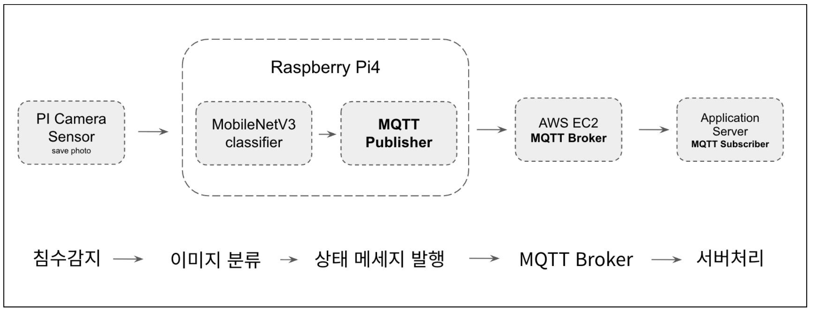

# 1. 프로젝트 소개 
- 이번에 발생한 기록적인 침수 사례를 보며, 침수 상황을 실시간으로 감지하고 즉시 대응할 수 있는 시스템의 필요성을 느껴 이 프로젝트를 시작했습니다.
이 프로젝트는 로컬(Edge) 환경에서 침수 여부를 실시간 분석하고, 판단 결과를 즉시 알림 형태로 전송할 수 있는 경량화된 AI 기반 침수 감지 시스템을 구축하는 것을 목표로 합니다.

# 2. 시스템 아키텍처

# 3. 주요 기능 
- Edge AI 추론(MobileNetV3 + TFLite)
- 침수/비침수 이미지 실시간 분류
- MQTT Publish
- AWS EC2 MQTT Broker 수신
- 향후 확장(UART → STM32 물리 제어 등)

# 4. 기술 스택
- Raspberry Pi4
- PiCamera2
- TensorFlow / Keras / TFLite
- MobileNetV3 Fine-tuning
- colab
- OpenCV
- MQTT (paho-mqtt)
- AWS EC2 (Mosquitto Broker)
- Python 3.13

5. 데이터셋 & 학습 과정 (Dataset & Training)
## 📘 Dataset Samples
| Flood | Normal |
|-------|--------|
|  |  |

# 향후
1. STM32 보드와의 UART 연동을 통한 물리적 제어 시스템 확장
침수 감지 이벤트가 발생하면 Raspberry Pi가 UART를 통해 STM32 보드로 신호를 전송하고,
STM32에서는 수신한 상태 값에 따라 LED 점등, 부저 알람 등 실제 물리적 액션을 수행하는 구조로 확장할 예정입니다.